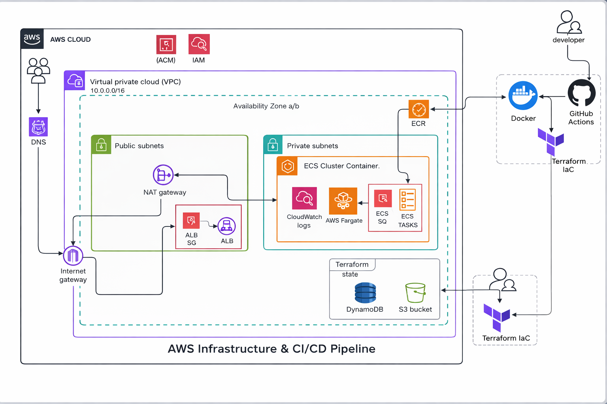
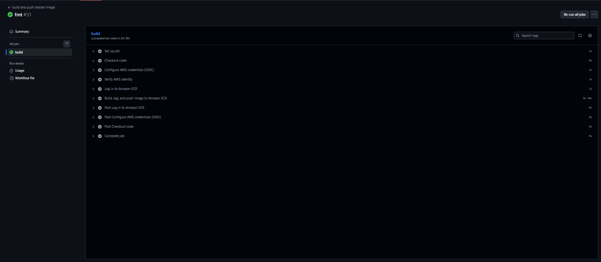
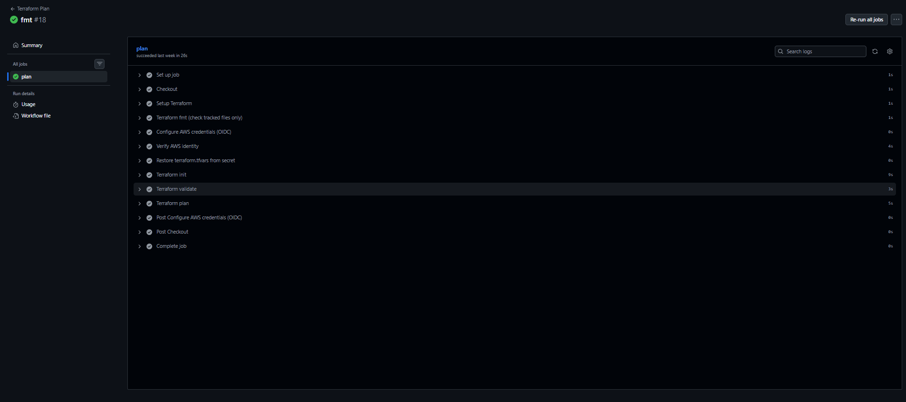
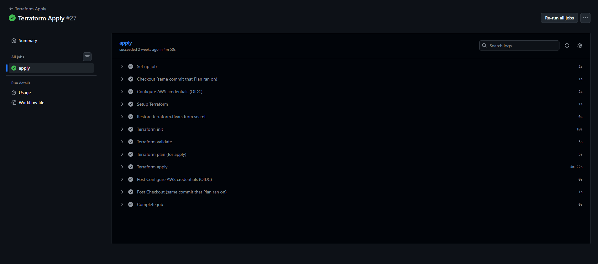
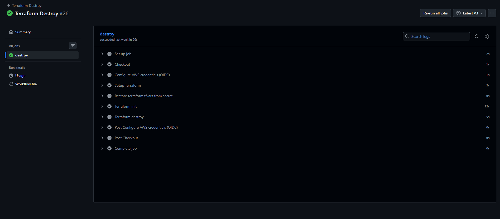
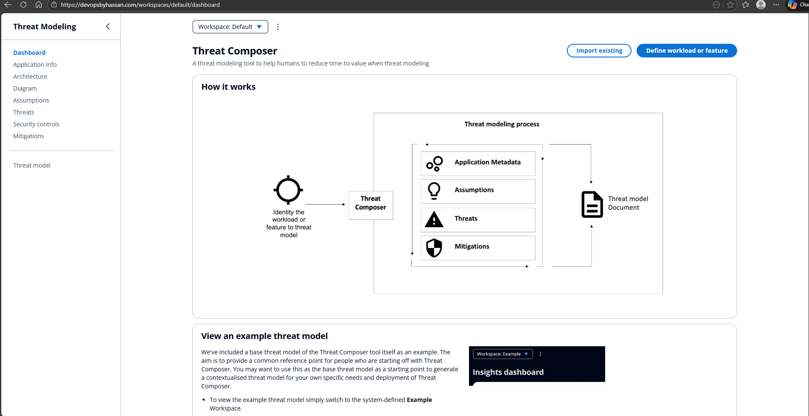
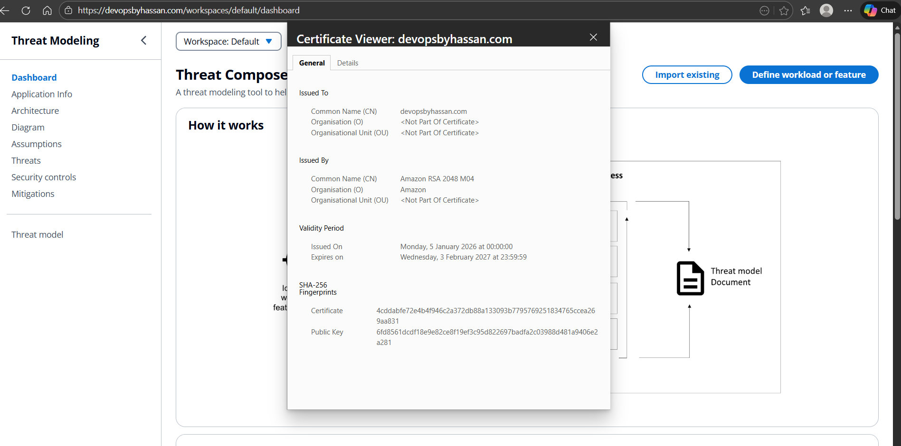

## ECS Fargate Deployment (Terraform + GitHub Actions OIDC)

This project deploys a containerised application to AWS ECS (Fargate) using Terraform for infrastructure and GitHub Actions for CI/CD. Docker images are built and pushed to Amazon ECR, and infrastructure is managed through automated Plan / Apply / Destroy workflows.

What this project includes

✅ Docker build & push to Amazon ECR

✅ ECS Fargate service deployment

✅ Application Load Balancer (ALB) routing traffic to ECS tasks

✅ DNS via Route 53 (domain example: devopsbyhassan.com)

✅ GitHub → AWS authentication using OIDC (no static AWS keys in GitHub)

✅ Terraform remote backend support (S3 state + DynamoDB locking) 

## Architecture




## repository structure
```text
├── ECS PROJECT/                      
│   └── (React UI + Dockerfile)
│
├── terraform/                
│   ├── main.tf
│   ├── provider.tf
│   ├── variables.tf
│   ├── outputs.tf
│   ├── terraform.tfvars
│   └── modules/
│       ├── vpc/
│       ├── alb/
│       ├── ecs/
│       ├── acm/
│       ├── dns/
│       ├── iam/
│       ├── sg/
│       └── s3/
│
└── .github/
    └── workflows/
        ├── build.yaml
        ├── plan.yaml
        ├── apply.yaml
        └── destroy.yaml

```

 ## CI/CD Workflows

1) Build → Push (ECR)

- Trigger: push to deployment 

- Builds Docker image from Application/

- Pushes image to ECR



2) Terraform Plan

Trigger: push to deployment (Terraform changes) 

Restores terraform.tfvars from GitHub Secret 

Runs:

- terraform init

- terraform validate

- terraform plan




3) Terraform Apply

Trigger: automatically after Terraform Plan succeeds 

Runs:

- terraform plan -out=tfplan

- terraform apply tfplan



4) Terraform Destroy


Trigger: manual only (recommended)

Requires confirmation input (safety)

Runs:

- terraform destroy



## GitHub Configuration

Go to: Repo → Settings → Secrets and variables → Actions

Secrets

AWS_ROLE_ARN — IAM role assumed via GitHub OIDC

TFVARS_B64 — base64-encoded terraform.tfvars

Variables

AWS_REGION — e.g. eu-west-2

ECR_REPOSITORY — your ECR repo name (e.g. ecs-project-app)

## Managing terraform.tfvars (Safe Method)

- Do not commit terraform.tfvars. Store it as base64 in GitHub Secrets.

From repo root

- base64 -w 0 Terraform/terraform.tfvars > tfvars.b64
cat tfvars.b64

- Copy the output into GitHub Secret: TFVARS_B64.

- Your workflows restore it at runtime.


## Local Terraform Commands 
```text
cd Terraform
terraform fmt -recursive
terraform init
terraform validate
terraform plan
terraform apply -auto-approve
```
### To run Locally 
```text
To run the app locally 
git clone https://github.com/hassansharif15/ECS-Projects
cd ECS PROJECTS
cd application
npm install
docker build -t threat-comp-app
docker run -p 8080:8080 threat-comp-app
```


 ### Useful AWS CLI Checks
- aws ecs list-clusters --region eu-west-2
- aws ecs list-services --cluster <CLUSTER_NAME_OR_ARN> --region eu-west-2

- aws elbv2 describe-load-balancers --region eu-west-2
- aws elbv2 describe-target-groups --region eu-west-2

- aws route53 list-hosted-zones
- aws route53 list-resource-record-sets --hosted-zone-id <HOSTED_ZONE_ID>





