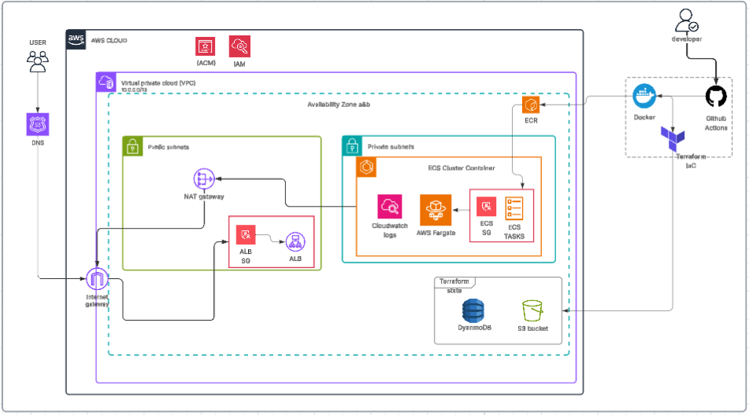
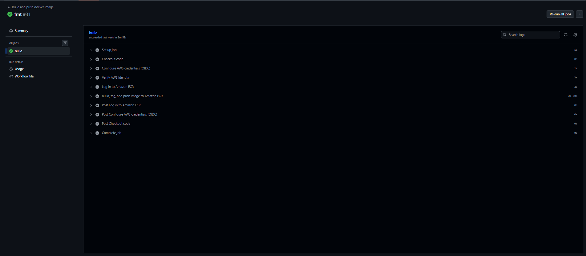
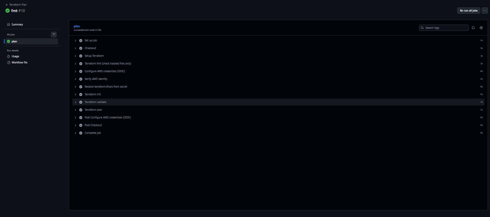
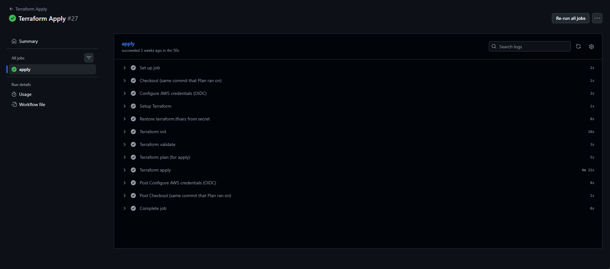
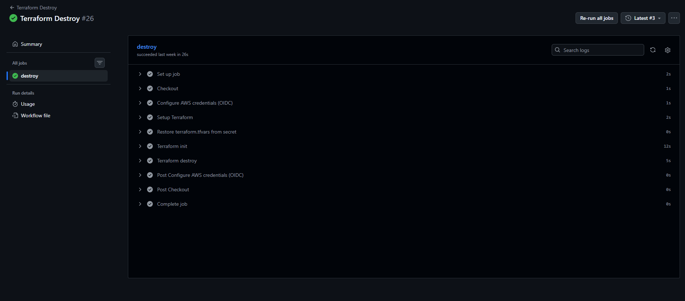
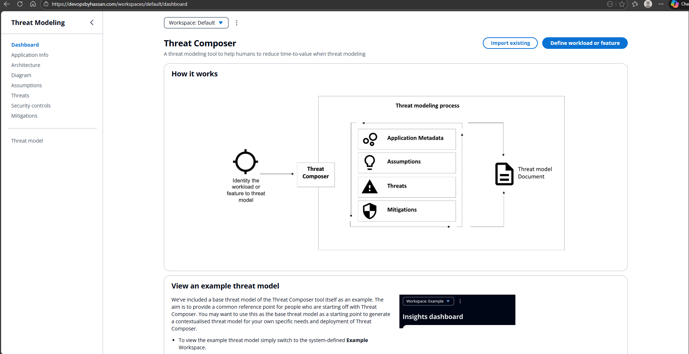
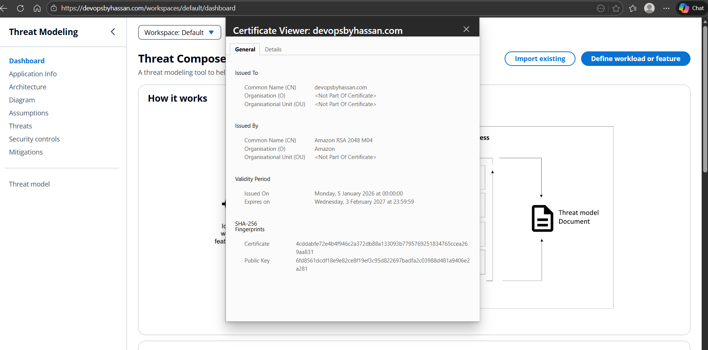

# 🚀 ECS Fargate Deployment
### *Terraform + GitHub Actions OIDC*

<div align="center">


</div>

---

##  Overview

Deploys a containerised React application to **AWS ECS Fargate** with infrastructure-as-code (Terraform) and automated CI/CD pipelines (GitHub Actions). Docker images are built and pushed to Amazon ECR, with full infrastructure management through automated workflows.

###  Key Features

| Feature | Details |
|---------|---------|
|  **Container Registry** | Docker build & push to Amazon ECR |
|  **Compute** | ECS Fargate service deployment (serverless) |
|  **Load Balancing** | Application Load Balancer (ALB) with intelligent traffic routing |
|  **DNS & SSL** | Route 53 + ACM (domain: devopsbyhassan.com) |
|  **Security** | GitHub → AWS via OIDC (no static credentials) |
|  **State Management** | Terraform backend with S3 + DynamoDB locking | 


---

##  Architecture

<div align="center">



</div>


---

##  Repository Structure

```
ECS-Projects/
│
├──  Application/                          # React UI + Docker 
│   
   
│
├──  Terraform/                           
│   ├── main.tf
│   ├── provider.tf
│   ├── variables.tf
│   ├── outputs.tf
│   ├── terraform.tfvars
│   └──  modules/
│       ├── vpc/
│       ├── alb/
│       ├── ecs/
│       ├── acm/
│       ├── dns/
│       ├── iam/
│       ├── sg/
│       └── s3/
│
├──  .github/workflows/                  
│   ├── build.yaml
│   ├── plan.yaml
│   ├── apply.yaml
│   └── destroy.yaml
│
└── README.md                               
```

---

## ⚙️ CI/CD Workflows

### 1️⃣ Build & Push to ECR
**Trigger:** Push to `deployment` branch
- Builds Docker image from `Application/`
- Pushes image to Amazon ECR



---

### 2️⃣ Terraform Plan
**Trigger:** Push to `deployment` (Terraform changes)
- Restores `terraform.tfvars` from GitHub Secrets
- Executes `terraform init`
- Executes `terraform validate`
- Executes `terraform plan`



---

### 3️⃣ Terraform Apply
**Trigger:** Automatically after Plan succeeds
- Generates `terraform plan -out=tfplan`
- Applies changes with `terraform apply tfplan`



---

### 4️⃣ Terraform Destroy
**Trigger:** Manual only (safety feature)
- Requires confirmation input
- Executes `terraform destroy`



---

## 🔧 Configuration

### GitHub Secrets & Variables

Navigate to: **Repo → Settings → Secrets and variables → Actions**

####  Secrets
| Secret | Purpose |
|--------|---------|
| `AWS_ROLE_ARN` | IAM role assumed via GitHub OIDC |
| `TFVARS_B64` | Base64-encoded `terraform.tfvars` |

####  Variables
| Variable | Example |
|----------|---------|
| `AWS_REGION` | `eu-west-2` |
| `ECR_REPOSITORY` | `ecs-project-app` |

###  Managing terraform.tfvars (Safe Method)

>  **Never commit `terraform.tfvars`** — Store it as base64 in GitHub Secrets

From repository root:

```bash
# Encode terraform.tfvars to base64
base64 -w 0 Terraform/terraform.tfvars > tfvars.b64

# Display the encoded content
cat tfvars.b64
```

Copy the base64 output into GitHub Secret: `TFVARS_B64`

Workflows automatically restore it at runtime.


---

## 🚀 Getting Started

### Local Development

#### Clone & Setup
```bash
git clone https://github.com/hassansharif15/ECS-Projects
cd ECS-Projects/Application
npm install
```

#### Build & Run Docker Image
```bash
docker build -t threat-comp-app .
docker run -p 8080:8080 threat-comp-app
```

Access the app at: `http://localhost:8080`

### Terraform Commands (Local)

```bash
cd Terraform

# Format code
terraform fmt -recursive

# Initialize backend
terraform init

# Validate configuration
terraform validate

# Preview changes
terraform plan

# Apply changes
terraform apply -auto-approve
```

---

## 📊 AWS CLI Commands

### ECS
```bash
# List ECS clusters
aws ecs list-clusters --region eu-west-2

# List services in cluster
aws ecs list-services --cluster <CLUSTER_NAME_OR_ARN> --region eu-west-2
```

### Load Balancer
```bash
# Describe load balancers
aws elbv2 describe-load-balancers --region eu-west-2

# Describe target groups
aws elbv2 describe-target-groups --region eu-west-2
```

### Route 53 (DNS)
```bash
# List hosted zones
aws route53 list-hosted-zones

# List DNS records
aws route53 list-resource-record-sets --hosted-zone-id <HOSTED_ZONE_ID>
```

---

## 🎨 Project Showcase

<div align="center">

| Application | Certificate |
|-------------|-------------|
|  |  |

</div>

---


---

<div align="center">


</div>
